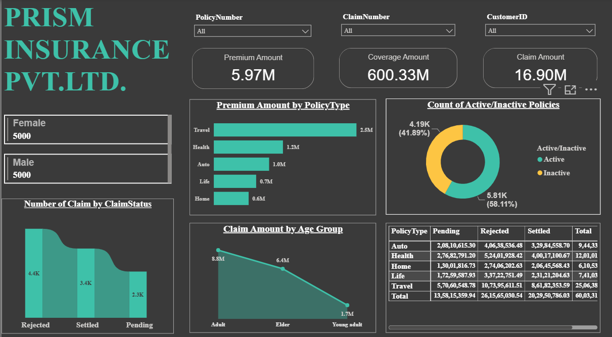
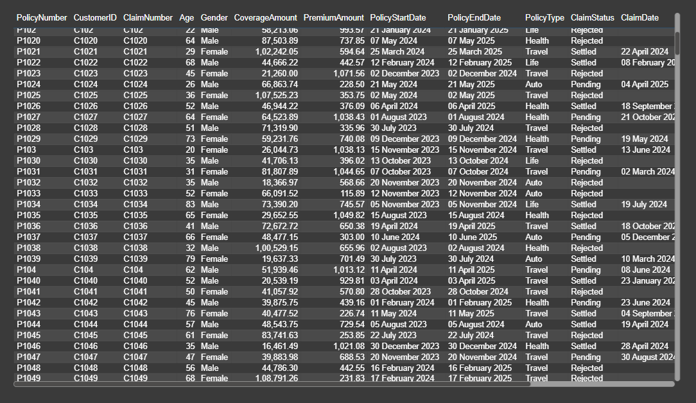

# Insurance Analytics Dashboard

An interactive Power BI dashboard designed to analyze insurance premiums, coverage, policy activity and claim performance.

## Tools
- Power BI
- Power Query and DAX (include only if used)
- Data Visualization

## Dashboard Overview
- Total Premium: 5.97M
- Total Coverage: 600.33M
- Total Claims: 16.90M
- Active Policies: 5.81K (58.11%)
- Inactive Policies: 4.19K (41.89%)

## Features
- Premium analysis by policy type
- Active vs. inactive policy distribution
- Claim status analysis
- Claim amount by age group
- Policy-wise claims summary
- Interactive slicers for policy, claim and customer IDs

## Key Observations
- Travel insurance has the highest premium amount among the displayed policy categories.
- Active policies account for approximately 58% of policies.
- Adult customers account for the highest displayed claim amount among the age groups.

## Dashboard Preview

## How to Use
Download the PBIX file and open it in Power BI Desktop. If the source dataset is stored separately, update the data source path and refresh the report.

## Author
Tushar Sharma